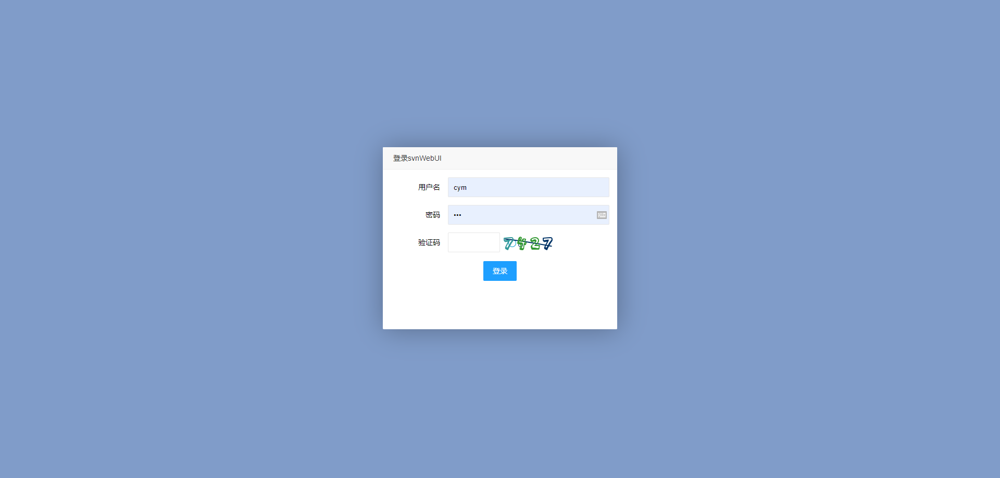
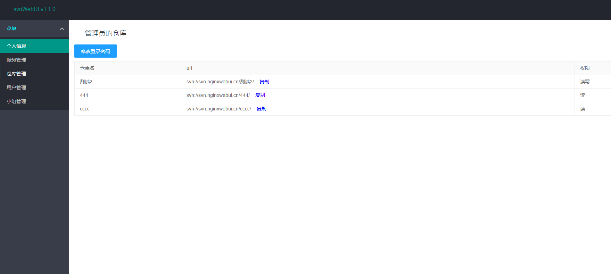
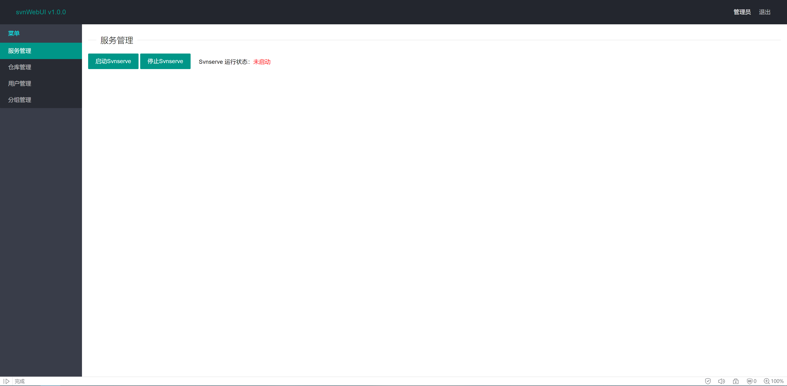
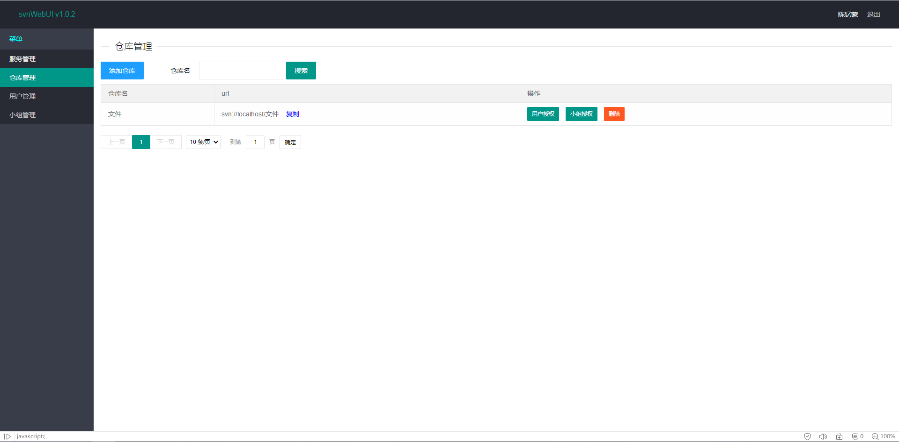
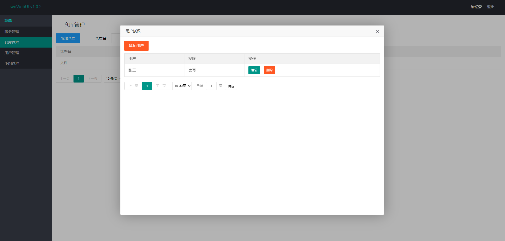
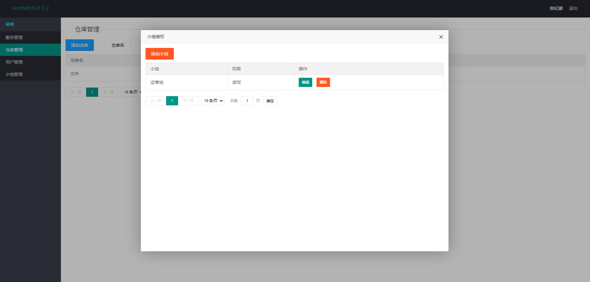
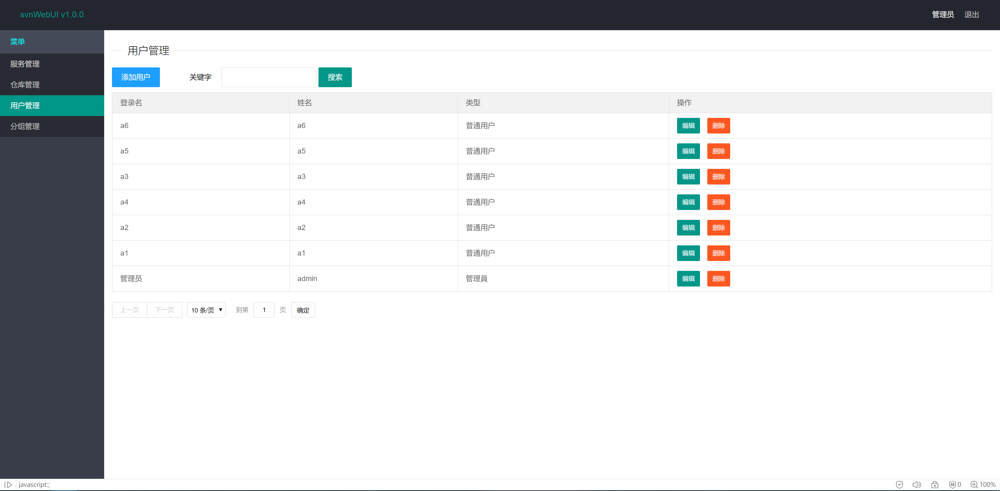
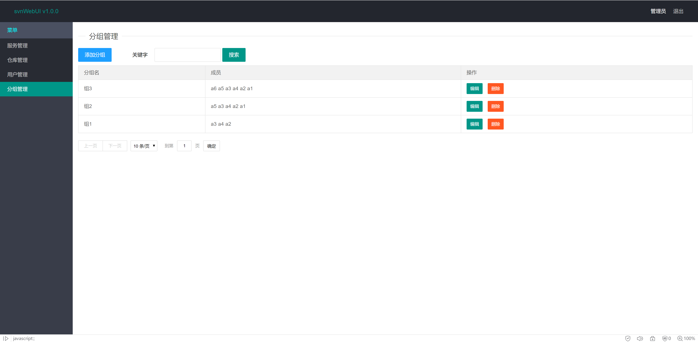

# svnWebUI


#### 介绍
svnWebUI是一款svn服务端web图形化管理工具, 是一个搭建svn服务器的神器.

github: https://github.com/cym1102/svnWebUI

QQ技术交流群1: 1106758598

QQ技术交流群2: 560797506

邮箱: cym1102@qq.com

微信捐赠二维码


#### 功能说明

svnWebUI是一款图形化管理Subversion的配置得工具, 虽说现在已进入git的时代, 但svn依然有不少使用场景, 比如公司内的文档管理与共享, svn的概念比git的少很多, 非常适合非程序员使用.

但众所周知svn的Linux服务端软件即Subversion的用户和权限配置全部依靠手写配置文件完成, 非常繁琐且不便, 已有的几款图像界面软件已经非常古老, 安装麻烦而且依赖环境非常古老, 比如csvn还使用python2作为环境变量.

Windows上倒是有不错的svn服务端软件即VisualSVN, 但一来Windows服务器少之又少, 第二VisualSVN没有web界面, 每次配置需要开启远程桌面, 安全性不高.

经历几次失败的图形界面配置后, 萌生了写一个现代svn服务端管理软件, 让svn的服务端管理有gitea一般的轻松体验的想法.

#### 技术说明

本项目是基于solon的java项目, 数据库使用sqlite, 因此服务器上不需要安装任何数据库, 同时也兼容使用mysql

本地运行本软件，请先安装Subversion，并使用svn:\\\\协议进行checkout。

使用docker版则无需安装任何其他软件，使用http:\\\\协议进行checkout。


#### 安装说明

1.安装java环境和Subversion

Ubuntu:

```
apt update
apt install openjdk-11-jdk
apt install subversion
```

Centos:

```
yum install java-11-openjdk
yum install subversion
```

Windows:

```
下载并安装JDK安装包 https://www.oracle.com/java/technologies/downloads/
配置JAVA环境变量 
JAVA_HOME : JDK安装目录
Path : JDK安装目录\bin
```


2.下载最新版发行包jar

```
Linux:  mkdir /home/svnWebUI/
        wget -O /home/svnWebUI/svnWebUI.jar https://gitee.com/cym1102/svnWebUI/releases/download/1.9.0/svnWebUI-1.9.0.jar

Windows: 直接使用浏览器下载 https://gitee.com/cym1102/svnWebUI/releases/download/1.9.0/svnWebUI-1.9.0.jar 到 D:/home/svnWebUI/svnWebUI.jar
```

有新版本只需要修改路径中的版本即可

3.启动程序

```
Linux: nohup java -jar -Dfile.encoding=UTF-8 /home/svnWebUI/svnWebUI.jar --server.port=6060 > /dev/null &

Windows: java -jar -Dfile.encoding=UTF-8 D:/home/svnWebUI/svnWebUI.jar --server.port=6060
```

参数说明(都是非必填)

--server.port 占用端口, 默认以6060端口启动

--project.home 项目配置文件目录，存放仓库文件, 数据库文件等, 默认为/home/svnWebUI/

--database.type=mysql 使用其他数据库，不填为使用本地sqlite数据库

--database.url=jdbc:mysql://ip:port/dbname 数据库url

--database.username=root 数据库用户

--database.password=pass 数据库密码

注意命令最后加一个&号, 表示项目后台运行

#### docker安装说明

本项目制作了docker镜像, 支持 x86_64/arm64 平台，同时包含subversion apache2和svnWebUI在内, 与jar版不同的是docker版支持使用http协议访问svn

1.安装docker容器环境

Ubuntu:

```
apt install docker.io
```

Centos:

```
yum install docker
```

2.拉取镜像: 

```
docker pull cym1102/svnwebui:latest

或者国内源

docker pull registry.cn-hangzhou.aliyuncs.com/cym19871102/svnwebui:latest

```

3.启动容器: 

```
docker run -itd -v /home/svnWebUI:/home/svnWebUI -e BOOT_OPTIONS="--server.port=6060" --privileged=true -p 6060:6060 -p 3690:3690 cym1102/svnwebui:latest

或者国内源

docker run -itd -v /home/svnWebUI:/home/svnWebUI -e BOOT_OPTIONS="--server.port=6060" --privileged=true -p 6060:6060 -p 3690:3690 registry.cn-hangzhou.aliyuncs.com/cym19871102/svnwebui:latest
```

注意: 

1. 需要映射6060端口与3690端口, 6060为web网页端口, 3690为svn默认端口. 

2. 容器需要映射路径/home/svnWebUI:/home/svnWebUI, 此路径下存放项目所有数据文件, 包括数据库, 配置文件, 日志等, 升级镜像时, 此目录可保证项目数据不丢失. 请注意备份.

3. -e BOOT_OPTIONS可以填写和jar启动一样的参数

#### 编译说明

使用maven编译打包

```
mvn clean package
```

使用docker构建镜像

```
docker build -t svnwebui:latest .
```

#### 添加开机启动


1. 编辑service配置

```
vim /etc/systemd/system/svnwebui.service
```

```
[Unit]
Description=SvnWebUI
After=syslog.target
After=network.target
 
[Service]
Type=simple
User=root
Group=root
WorkingDirectory=/home/svnWebUI
ExecStart=/usr/bin/java -jar -Dfile.encoding=UTF-8 /home/svnWebUI/svnWebUI.jar
Restart=always
 
[Install]
WantedBy=multi-user.target
```

之后执行

```
systemctl daemon-reload
systemctl enable svnwebui.service
systemctl start svnwebui.service
```

#### 使用说明

打开 http://ip:6060 进入主页


首次打开页面, 需要注册管理员账户



注册完毕后, 进入登录页面进行登录



个人信息, 可在这个页面查看当前用户的拥有仓库, 并可修改用户密码.



服务管理, 可在这个页面查看Subversion服务的开启情况, 并进行停止和重启.



仓库管理, 可添加仓库及修改仓库, 添加仓库后即可获得仓库的svn地址, 在Subversion服务开启的情况下可直接checkout, 十分方便



选择对应的用户对仓库进行授权, 可以授权到某个目录



选择对应的小组对仓库进行授权, 可以授权到某个目录



用户管理, 可添加和编辑用户, 用户分两种, 管理员和普通用户, 普通用户只能看到自己的信息, 管理员可管理整个平台的信息



小组管理, 可添加和编辑小组

#### 找回密码

如果忘记了登录密码，可按如下教程找回密码

1.停止svnWebUI

```
pkill java
```

2.使用找回密码参数运行svnWebUI.jar

```
java -jar svnWebUI.jar --project.home=/home/svnWebUI/ --project.findPass=true
```

--project.home 为项目文件所在目录

--project.findPass 为是否打印用户名密码

#### open-API(供后端自动化开号/授权)

本 fork 新增了一组 HTTP open-API,供上游系统(如后端账号编排服务)以编程方式创建 svn 用户、覆盖式收敛其仓库授权、以及注销用户。API 不经过登录会话,依靠请求头令牌鉴权。

##### 令牌注入(env)

令牌通过环境变量 `SVNWEBUI_API_TOKEN` 注入:

```
docker run -e SVNWEBUI_API_TOKEN=<强随机令牌> ... cym1102/svnwebui
```

- **未配置(或为空)`SVNWEBUI_API_TOKEN` 时,整个 open-API 处于禁用状态**:任何 `/api/*` 请求一律返回 `success=false`,不读取请求体、不做任何数据库写入、不重写配置文件,svnWebUI 其余现有行为与未启用时完全一致(零副作用)。
- 请求必须携带请求头 `X-Api-Token`,其值需与 `SVNWEBUI_API_TOKEN` 完全一致;缺失或不匹配时返回 `success=false, status=401`,且**在任何数据库写入之前**即被拒绝(鉴权失败不会产生任何副作用)。
- 生产环境请务必仅经 HTTPS / 私网暴露本 API(令牌与口令以明文在请求体中传输)。

##### 响应形状(JsonResult)

所有接口 HTTP 状态码恒为 200,业务结果承载于 JSON 响应体(与站内其它接口一致):

```json
{ "success": true, "status": "200", "msg": null, "obj": null }
```

- `success`:布尔,业务是否成功(调用方应仅据此判定)。
- `status`:字符串状态码(如鉴权失败为 `"401"`)。
- `msg`:失败时的错误描述。

##### POST /api/provision

创建或更新用户,并以**覆盖式收敛**方式重写该用户在指定仓库下的授权(先清空该用户在该仓库的全部旧授权,再按 `paths` 全量写入)。仓库必须已存在(本接口不创建仓库)。

请求头:`X-Api-Token: <令牌>`,`Content-Type: application/json`

请求体:

```json
{
  "user": "alice",
  "pass": "明文口令",
  "repo": "knowledge-repo",
  "paths": [
    { "path": "/knowledge", "permission": "r" },
    { "path": "/knowledge/alice", "permission": "rw" }
  ]
}
```

- `permission` 取值 `r` / `rw`(与站内一致)。
- 用户不存在则新建(普通用户 `type=0`、启用 `open=0`);已存在则更新其口令(改密幂等)。
- 成功后重生成 `passwd` / `authz` 配置文件并返回 `success=true`。

##### POST /api/revoke

硬删用户及其全部授权(级联删除该用户在所有仓库下的 `RepositoryUser` 行),然后重生成配置文件。对不存在的用户调用也返回 `success=true`(幂等)。

请求头:`X-Api-Token: <令牌>`

请求体:

```json
{ "user": "alice", "repo": "knowledge-repo" }
```

运行成功后即可打印出全部用户名密码